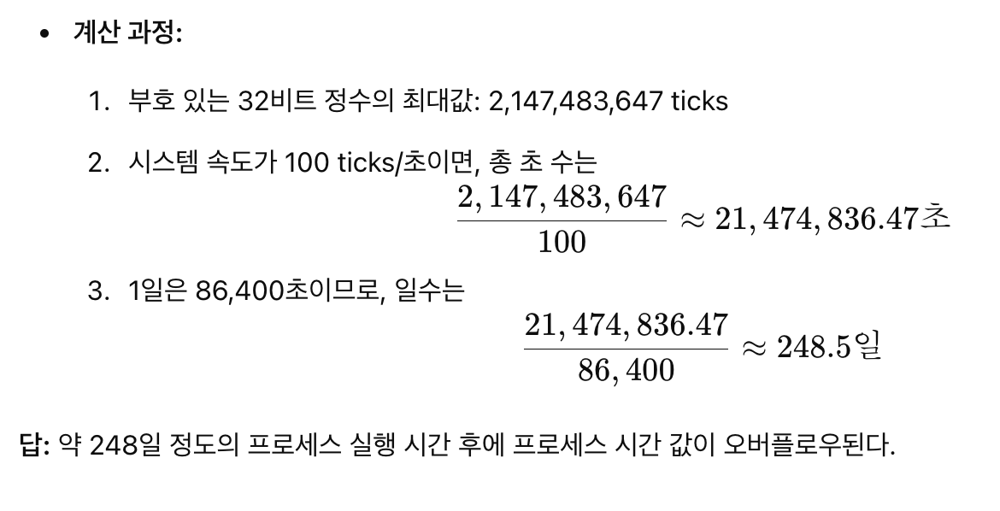

## **1.1 개요**

UNIX System(UNIX 시스템) - 유닉스라고 불릴 자격이 있는 모든 운영체제를 포괄하는 추상적인 개념

UNIX system(유닉스 시스템) - 그러한 추상적 개념을 구현한 구체적인 운영체제

## **1.2 UNIX 기반구조**

운영체제 : 컴퓨터의 하드웨어 자원들을 제어, 프로글매이 실행될 수 있는 환경을 제공하는 소프트웨어

이러한 소프트웨어를 커널 이라고도 부름

커널의 인터페이스는 시스템호출이라고 부르는 소프트웨어 계층이다.

공통 함수 라이버리르들은 이러한 시스템 호출 인터페이스를 기반으로 삼아 구축 됨.

Linux는 GNU 운영체제에 쓰이는 커널 => GNU/Linux 운영체제라고 부르기도 함

## **1.3 로그인**

\- 로그인이름

패스워드 파일

하나의 행이 콜론으로 구분 된 필드 일곱개로 구성

**로그인이름 : 암호화된 패스워드 : 사용자 ID를 뜻하는 정수 : 그룹 ID를 뜻하는 정수 : 주석필드 : 홈 디렉터리 : 셸 프로그램**

\`sar:x:205:105:Stephen Rago:/home/sar:/bin/ksh\`

\- 셸

유닉스 시스템들에서 흔히 쓰이는 셸들

1\. 본 셸 : 기초 쉘

2\. 본어게인 셸 : 셸 확장

3\. C 셸 : UNIX 6판 셸을 기반으로 한 것

4\. 콘 셸 :  본 셸과 상위호환, C 셸이 인기를끈 요소등을 포함

5\. TENEX C 셸 :  C 셸의 개선 판

## **1.4 파일과 디렉터리**

\- 파일 시스템

- stat 함수 & fstat 함수 : 한 파일의 모든 특성을 담은 정보 구조체를 돌려 줌

\- 파일이름

- 파일이름에 셸의 특수문자들이 포함되어 있으면 파일 이름을 지칭할 때 쏄의 인용 메커니즘을 사용해야하는데 복잡해 질 수 있음

- 이식성을 위해 POSIX.1은 파일이름에 사용할 수 있는 문자를 영문자, 숫자, 마침표, 대시, 밑줄로만 제한

\* POSIX : portable operating syetem interface 일부 , UNIX 계열 운영체제에서 애플리케이션이 소로 호환되도록 하기위해 정한 표준

\* fopen(3S) : forpen UNIX계열 시스템에서 파일을 여는 표준 라이브러리 함수

- section3 -> C라이브러리 함수

- fopen이 여기 포함,

.c  -> 컴파일 -> .out 실행파일 생성

\- opendir : DIR 구조체를 가리키는 포인터를 돌려줌

\- readdir : opendir 포인터 호출을 씀

\- readdir : dirent 구조체를 가리키는 포인터를 돌려줌 , 더 이상 읽을 항목이 없으면 null 포인터를 돌려줌

\- exit : 프로그램을 끝내는 역할 / 인수 0 = 정상 , 1, 255는 오류가 발생을 뜻함

## **1.5 입력과 출력**

파일 서술자(file descriptor)는 커널이 한 프로세스가 접근하는 파일들을 식별하기 위해 사용

모든 셸은 프로그램이 새로 실행될 때마다 세 개의 파일 서술자를 연다.

1\. 표준 입력 (standard input)

2\. 표준 출력 (standard output)

3\. 표준 오류 (standard error)

버퍼링 없는 입출력

\- 함수 : open, read, write, lseek, close

\- 이 함수들은 모두 파일 서술자에 대해 작동

표준 입출력

표준 입출력 함수들은 버퍼링 없는 입출력 함수들에 대한 버퍼링 있는 인터페이스를 제공한다.

ex)

```
버퍼링 있는 인터페이스는 데이터를 모으고 나서 버퍼가 가득하면 한 번에 OS에 전달하는 방법이야. 이 과정에서 직접 OS 호출을 피할 수 있어.

우편물 비유
버퍼링 없는 경우
편지를 한 장 한 장 쓸 때마다 매번 우체국에 가서 직접 부치고 온다고 상상해 보세요. 이건 굉장히 비효율적입니다. 한 장 부칠 때마다 시간을 써서 다녀와야 하니까요.

버퍼링 있는 경우 (표준 입출력 함수 방식)
이번에는 편지 여러 장을 쓰면서, 한쪽에 우체통 역할을 하는 작은 상자(=버퍼)를 둡니다. 편지를 한 장 쓸 때마다 바로 우체국에 가지 않고, 상자에 임시로 모아둡니다. 그리고 상자(버퍼)가 가득 차거나, 특정 시점에 도달하면(예: '편지 다 썼다!'라고 판단되면) 한꺼번에 우체국에 가져다 부치죠.
이렇게 하면 자잘한 이동 횟수가 줄어들기 때문에 훨씬 효율적입니다.
```

## **1.6 프로그램과 프로세스**

- 프로그램
  디스크의 디렉터리에 있는 실행 파일(.exe)
  프로그램의 실행은 7개 exec 함수 중 하나의 호출에 의해 시작 됨

- 프로세스와 프로세스 ID
  현재 실해되고 있는 프로그램의 한 인스턴스를 process라고 부름
  UNIX 시스템은 모든 프로세스에 각자 고유한 수치 식별자가 있음을 보장.
  그 식별자를 **프로세스 ID** 라고 부름
  프로세스 ID는 항상 음이 아닌 정수이다.

- 프로세스 제어
  주요 함수 3가지

1. fork
2. exec
3. waitpid

fork 호출하면 새 프로세스 생성
새 프로세스는 그 함수를 호출한 프로세스(이하 호출 프로세스)의 복사본
호출 프로세스를 부모 프로세스, 새로 생성된 자식 프로세스라고 부른다.
부모 프로세스에게는 새로 생성 된 자식 프로세스의 process ID를 돌려주고,
자식 에게는 0을 돌려줌
새로운 프로세스를 생성하므로, 한 번 호출되나 두 번 반환된다고 말할 수 있다

- 스레드와 스레드 ID
  제어의 줄기 = 스레드
  1 프로세스 : 1 제어의 줄기
  1 프로세스 : n 제어의 줄기 = 다중 프로세서 시스템

프로세스 내의 스레드들은 프로세스 자원 공유 가능
스레드 ID는 한 프로세스 안에서만 유효

## 1.7 오류처리

대체로 오류 발생 시 음의 값을 돌려줌,
또한 오류의 원인을 말해 주는 값이 errno라는 정수 개체에 설정되는 경우도 많음
오류 시 널 포인터를 돌려주는 케이스도 있음

다중 스레드를 지원하는 환경에서는 프로세스 주소 공간을 여러 스레드가 공유하기 때문에,
스레드들 사이에서 오류 번호 혼선을 막기 위해 각 스레드마다 개별 errno 복사본을 둘 필요가 있음
**errno 명심해야 할 규칙 2개**

1. 어떤 루틴에서 오류가 없었다고 해서 errno의 값이 비워지지는 않는다.
2. errno의 값을 0으로 설정하는 함수는 없음.

- 오류 복구
  errno.h 에 정의된 오류들은 크게 두 범주로 나눌 수 있다.

1. 치명적 오류 fatal error

- 복구 동작이 전혀 없음
- 할 수 있는 일 : 오류 메시지를 사용자 화면이나 로그파일에 출력하고 프로그램을 종료하는 것 뿐

2. 치명적이지 않은 오류(nonfatal error)

- 대부분 오류는 임시적

## 1.8 사용자 식별

- 사용자 ID (uid)
  시스템 관리자가 사용자의 로그인 이름을 배정할 때 함께 배정하며, 사용자 자신이 바꿀 수 없다.
  0인 사용자를 루트 또는 슈퍼사용자 라고 부른다.

- 그룹 ID (gid)
  시스템 관리자가 사용자의 로그인 이름을 배정할 때 함께 배정
  접근권한 제어

- 추가 그룹 ID
  한 사용자가 최대 16개의 추가 그룹에 속할 수 있다.

## 1.9 신호(signal)

어떤 특정한 조건이 발생했음을 프로세스에게 알려주는 기법

신호로 할 수 있는 일 3가지

1. 신호를 무시한다.
2. 기본 동작이 일어나게 한다.
3. 신호를 처리할 함수가 호출되게 한다.

다른 프로세스에게 신호를 보내려면, 해당 사용자가 다른 프로세스의 소유자 또는 슈퍼사용자 이여야 함

## 1.10 시간 값

역사적으로 유닉스 시스템들은 다음과 같은 두 종류의 시간 값을 유지했다.

### 달력 시간

UNIX기원으로부터 흐른 초의 개수
UNIX기원은 협정 세계시(Coordinated Universal Time, UTC)기준 1970년 1월 1일 00:00:00 를 말한다.

### 프로세스 시간

CPU 시간이라고도 부르는 이 시간 값은, 한 프로세스가 중앙 처리 장치자원들을 사용한 시간을 측정한 것
프로세스 시간의 단위는 클록 틱이다.
한 프로세스에서 세가지 값을 관리함

1. 클록 시간 : 프로세스가 실행된 전체 시간
2. 사용자 CPU 시간 : 사용자 명령들에 소비된 CPU 시간
3. 시스템 CPU 시간 : 프로세스의 요청에 의해 커널이 소비한 CPU 시간

`**CPU 시간 = 사용자 CPU 시간 + 시스템 CPU 시간**`

## 1.11 시스템 호출과 라이브러리 함수

모든 운영체제는 프로그램이 커널에게 서비스를 요청할 수 있는 서비스 지점들을 제공한다.
진입점을 시스템 호출이라고 부른다.

UNIX 시스템호출의 정의는 항상 C 언어로 되어 있다.
라이브러리 함수들은 원한다면 다른 것으로 대체할 수 있지만, 시슽메 호출은 일반적으로 다른 것으로 대체할 수 없다.

---

스템 호출(system call) vs 라이브러리 함수(library function)

1. 시스템 호출
   최소한의 인터페이스를 제공합니다.
   예: read(fd, buffer, size) 시스템 호출은 파일 디스크립터(fd), 버퍼, 크기만 전달받아 데이터를 읽어서 리턴할 뿐, 그 외 부가 기능은 거의 처리해주지 않습니다.
   운영체제 내부(커널)로 들어가는 것이므로, 매개변수나 반환값이 아주 단순·직접적이어야 하고, 보안과 안정성을 위해서도 복잡한 동작은 최소화하는 편입니다.
2. 라이브러리 함수
   조금 더 다듬어진 인터페이스를 제공합니다.
   예: fgets, fprintf, printf 등은 내부적으로 read나 write 같은 시스템 호출을 여러 번 호출하면서 에러 처리, 데이터 버퍼링 등 추가 기능을 해줍니다.
   사용자는 이러한 라이브러리 함수를 통해 좀 더 편리하고 풍부한 기능을 얻게 되죠.

“인터페이스가 최소/다듬어진”다는 말의 의미
최소한의 인터페이스(시스템 호출)

운영체제가 “이렇게 이 함수를 호출해야만 할 수 있다”라고 딱 정한 규칙(매개변수, 반환값 등)만 제공합니다.
예: read(fd, buffer, nbytes) -> “파일 디스크립터 fd로부터 nbytes만큼 buffer에 읽어들인다”는 규칙.
추가 기능을 제공하는 인터페이스(라이브러리 함수)

같은 읽기 작업이라도, 파일 포인터 관리, 버퍼링, 에러 처리 등을 내부에서 담당하고, 호출자에게는 더 단순하고 편리한 형태의 함수를 제공합니다.
예: fgets(char *str, int size, FILE *stream) -> 파일 포인터 stream으로부터 문자열을 읽어오되, 엔터(개행) 문자나 파일 끝(EOF)을 만나면 멈추고, 문자열로 반환해 준다. 내부적으로 시스템 호출 read가 여러 번 불릴 수 있습니다.
이처럼 시스템 호출 수준의 인터페이스는 정말 꼭 필요한 “핵심 기능”만을 제공하고, 라이브러리 함수는 이를 감싸는 형태로 다양한 편의 기능을 덧붙여서 더 편리한 함수를 만들어 내는 구조라고 보면 됩니다.

---

ㅠㅠ?

## 1.12 요약

1.2 도해 1.6의 프로그램의 출력에서, 프로세스 ID가 852와 853인 프로세스들에 어떤 일이 생긴 것 일까?

```
getpid()는 호출한 프로세스의 고유한 프로세스 ID를 반환한다.

실행 시 다른 프로세스 ID가 출력되는 이유:
매번 프로그램이 실행될 때마다 운영체제가 새로운 프로세스 ID를 할당한다.
따라서, 첫 번째 실행에서는 예를 들어 851,
두 번째 실행에서는 854와 같이 서로 다른 프로세스 ID가 출력되는 것이다.
실행 시마다 다른 PID가 출력되는 건 각 실행이 서로 다른 프로세스로 수행되기 때문
```

1.3 §1.7에서 perror의 인수에는 ISO C const 한정사가 붙는 반면 strerror의 정수 인수에는 불 지 않는다. 왜 그렇게 한 것일까?

```
 perror의 문자열 인수는 함수 내부에서 변경되지 않으므로 const 한정자를 붙여 안전성을 높였고,
 strerror의 정수 인수는 값 전달 방식이므로 const가 필요 없으며,
 반환되는 정적 버퍼와의 역사적/호환성 문제로 인해 반환형에 const 한정자가 붙지 않은 것이다.
```

1.4 달력 시간을 부호 있는 32비트 정수에 저장한다면 값이 넘치는 해(4)는 언제인가? 넘치는 시점을 연장하려면 어떻게 해야 할까? 그러한 연장 전략들이 기존 응용 프로그램과 호환될까?

```
달력 시간은 1970년 1월 1일 00:00:00(UNIX 기원)부터 흐른 초를 의미한다.
부호 있는 32비트 정수의 최댓값은 2,147,483,647초로, 이는 약 68년치 초를 표현할 수 있다.
실제로 이 한계는 2038년 1월 19일경에 도달하는 “2038 문제”로 알려져 있다.

부호 있는 32비트 정수로 달력 시간을 저장하면 2038년 1월 19일경 오버플로우가 발생한다.
이를 해결하려면 64비트 정수로 확장하는 방법이 있으나, 기존 응용 프로그램과의 인터페이스 및 호환성 문제를 해결하기 위한 추가 작업이 필요하다.
```

1.5 프로세스 시간을 부호 있는 32비트 정수에 저장한다면, 그리고 시스템의 초당 수가 100이라면 며칠이 지나야 프로세스 시간 값이 넘칠까?


---

```ts
지수적 후퇴 알고리즘 (exponential algorithm)
/**
 * 지수적 후퇴(Exponential Backoff)를 이용해 특정 작업을 재시도하는 함수
 * @param {Function} task - 실패할 수도 있는 비동기 작업 (예: fetch 요청 등)
 * @param {number} maxRetries - 최대 재시도 횟수
 * @param {number} initialDelay - 첫 대기 시간 (밀리초)
 * @param {number} factor - 지수 승수 (매 재시도마다 대기 시간을 몇 배 늘릴지)
 * @returns {Promise<any>} 작업 성공 시 결과를 반환하고, 실패 시 에러를 던집니다.
 */
async function exponentialBackoff(task, maxRetries = 5, initialDelay = 1000, factor = 2) {
  let attempt = 0;
  let delay = initialDelay;

  while (attempt < maxRetries) {
    try {
      // 실제 작업 실행
      return await task();
    } catch (error) {
      attempt++;
      if (attempt >= maxRetries) {
        throw new Error(`모든 재시도 실패: ${error.message}`);
      }
      console.log(`실패! 재시도 횟수: ${attempt}. ${delay}ms 후 재시도합니다.`);

      // 대기 (delay 시간 동안 기다렸다가 다음 루프로 이동)
      await new Promise((resolve) => setTimeout(resolve, delay));

      // 다음 재시도 시에는 대기 시간을 지수 형태로 증가
      delay *= factor;
    }
  }
}

// 실제로 사용해볼 예시: fetch 요청
async function fetchWithBackoff(url) {
  const task = async () => {
    const response = await fetch(url);
    if (!response.ok) {
      throw new Error(`HTTP Error! status: ${response.status}`);
    }
    return response.json();
  };

  try {
    const result = await exponentialBackoff(task, 5, 1000, 2);
    console.log('요청 성공:', result);
  } catch (error) {
    console.error(error);
  }
}

// 예시 사용
fetchWithBackoff('https://jsonplaceholder.typicode.com/todos/1');


```
